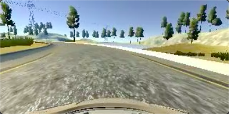
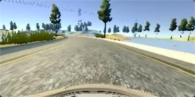

# **Behavioral Cloning** 

## Writeup

---

**Behavioral Cloning Project**

The goals / steps of this project are the following:
* Use the simulator to collect data of good driving behavior
* Build, a convolution neural network in Keras that predicts steering angles from images
* Train and validate the model with a training and validation set
* Test that the model successfully drives around track one without leaving the road
* Summarize the results with a written report


[//]: # (Image References)

[image1]: ./examples/model.jpg "Model Visualization"
[image2]: ./examples/center.png "Center"
[image3]: ./examples/left.png "right Image"
[image4]: ./examples/mid.png "mid Image"
[image5]: ./examples/flipped.png "flipped Image"
[image6]: ./examples/training.png "training Image"

## Rubric Points
---
### Files Submitted & Code Quality

#### 1. Submission includes all required files and can be used to run the simulator in autonomous mode

My project includes the following files:
* model.py containing the script to create and train the model
* model.ipynb for testing the model
* drive.py for driving the car in autonomous mode
* model.h5 containing a trained convolution neural network 
* writeup_report.md 

#### 2. Submission includes functional code
The codes are in the [Github Repo](https://github.com/CZacker/behavior-cloning/blob/master), and the test video is uploaded to [Youtube](https://youtu.be/o_H3n743X1o)
Using the Udacity provided simulator and my drive.py file, the car can be driven autonomously around the track by executing 
```sh
python drive.py model.h5
```

#### 3. Submission code is usable and readable

The model.py file contains the code for training and saving the convolution neural network. The file shows the pipeline I used for training and validating the model, and it contains comments to explain how the code works.

### Model Architecture and Training Strategy

#### 1. An appropriate model architecture has been employed
My model consists of a convolution neural network with 3x3 filter sizes and depths between 32 and 128.

The model includes RELU layers to introduce nonlinearity (model.py line 51), and the data is normalized in the model using a Keras lambda layer (code line 49). 

#### 2. Attempts to reduce overfitting in the model

The model contains dropout layers in order to reduce overfitting (model.py lines 52 & lines 54 &lines 56). 

The model was trained and validated on different data sets to ensure that the model was not overfitting (code line 67). The model was tested by running it through the simulator and ensuring that the vehicle could stay on the track.

#### 3. Model parameter tuning

The model used an adam optimizer, so the learning rate was not tuned manually (model.py line 66).

#### 4. Appropriate training data

Training data was chosen to keep the vehicle driving on the road. I used a combination of center lane driving, recovering from the left and right sides of the road, also slow down the speed and holding down the left mouse button to adjust the direction. 

For details about how I created the training data, see the next section. 

### Model Architecture and Training Strategy

#### 1. Solution Design Approach

Here is the model, It consists of several convolution neural layers and dense layers. It is similar to the NVIDIA model. To prevent overfitting I add some dropout layers.

&emsp;&emsp;![alt text][image1]


#### 2. Final Model Architecture

The final model architecture (model.py lines 18-24) 

| Layer                 |     Description                               | 
|:---------------------:|:---------------------------------------------:| 
| Input                 | input_shape=(160, 320, 3)                     | 
| Lambda                | ```lambda x: x / 255.0 - 0.5```    |
| Cropping2D            | ```cropping=((70, 25), (0, 0))```|
| Convolution 5x5       | 1x1 stride, VALID padding  subsample=(2,2) Activation='relu'|
| MaxPooling2D          |  pool_size=(2, 2), strides=(1, 1)                                             |
| Convolution 5x5       | 1x1 stride, VALID padding  subsample=(2,2) Activation='relu'|
| MaxPooling2D          |  pool_size=(2, 2), strides=(1, 1)                                             |
| Convolution 5x5       | 1x1 stride, VALID padding  subsample=(2,2) Activation='relu'|
| MaxPooling2D          |  pool_size=(2, 2), strides=(1, 1)            |
| Convolution 3x3       | 1x1 stride, VALID padding   Activation='relu'|
| MaxPooling2D          |  pool_size=(2, 2), strides=(1, 1)            |
| Convolution 3x3       | 1x1 stride, VALID padding   Activation='relu'|
| MaxPooling2D          |  pool_size=(2, 2), strides=(1, 1)            |
| Flatten               |            |
| Dense               | Layer=1164 |
| Dense| ```# regular densely-connected NN layer.``` Layer=100|
| Dense               | Layer=50 |
| Dense               | Layer=10 |
| Dense               | Layer=1 |

#### 3. Creation of the Training Set & Training Process

To capture good driving behavior, I first recorded two laps on track one using center lane driving. Here is an example image of center lane driving:

<div align=center></div>

I then recorded the vehicle recovering from the left side and right sides of the road back to center so that the vehicle would learn to go back to center These images show what a recovery looks like starting from right :

<div align=center></div>

<div align=center></div>

Then I repeated this process on track two in order to get more data points.

Also I used the multiple camera datas, more about this approach, see [this paper](http://images.nvidia.com/content/tegra/automotive/images/2016/solutions/pdf/end-to-end-dl-using-px.pdf) by NVIDIA that makes use of this technique.
loading multiple camera by following code:

```python
for line in lines:
    for i in range(3):
        source_path = line[i]
        current_path = './data/' + source_path.strip()
        image = cv2.imread(current_path)
        images.append(image)
        measurement = float(line[3])
        correction = 0.2  # this is a parameter to tune
        steering_left = measurement + correction
        steering_right = measurement - correction
        if i == 1:
            measurement = steering_left
        elif i == 2:
            measurement = steering_right
        measurements.append(measurement)
```

To augment the data sat, I also flipped images and angles thinking that this would generate more data and prevent the direction of the vehicle is always left. For example, here is an image that has then been flipped:

![alt text][image5]

After the collection process, I had 48215 number of data points. I then preprocessed this data by normalizing the pixels in images with a lambda layer and croped the top part of the images. 

```python 
model.add(Lambda(lambda x: x / 255.0 - 0.5, input_shape=(160, 320, 3)))
model.add(Cropping2D(cropping=((70, 25), (0, 0))))
```

I finally randomly shuffled the data set and put 20% of the data into a validation set. 
```python 
model.fit(x_train, y_train, validation_split=0.2, shuffle=True, epochs=5)
```
I used this training data for training the model. The validation set helped determine if the model was over or under fitting. The ideal number of epochs was 5 as evidenced by on track 1. I used an adam optimizer so that manually training the learning rate wasn't necessary.

The following is training window image:

![alt text][image6]


